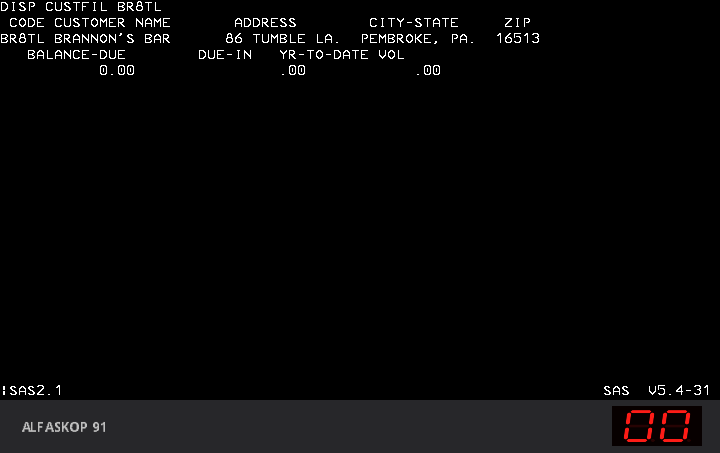

# Alfaskop 91 on a Univac 90/30 over SASALFA

This puts the emulated Ericsson Alfaskop 91 controller and its DU 4110 display
unit, running the SAS diskettes, on a line of an emulated Sperry Univac 90/30
running OS/3, ICAM and IMS. The two talk SASALFA, which turns out to be the
Uniscope 100 line procedure.



The A91 types `DISP CUSTFIL BR8TL`, the transaction goes over the line to IMS
on the 90/30, and the customer record comes back to the display unit.

## What works

* The A91 boots the two SAS diskettes, `50007035` (system) and `50007032`
  (emulation), "SNA / SASALFA" V5.4-31 of 24 February 1992, and the DU picks
  `SAS2.1` in the facility menu.
* The A91 runs its SASALFA line on channel B of its MK68564. A bridge polls it
  as the host would and passes the text to U9030's Uniscope adapter, which
  answers ICAM's polls.
* OS/3 starts ICAM and IMS; `** IMS READY **` and every IMS screen appear full
  screen on the DU, at the addressed rows and columns.
* Transactions typed on the DU reach IMS and get their answer: `DISP CUSTFIL`
  with a customer key shows the record.

What was learned on the way, protocol, display unit program, keyboard and the
90/30 side, is in [docs/NOTES.md](docs/NOTES.md).

## How it is wired

```
MAME a91du             sasalfa-bridge.py              U9030 (Windows)
MK68564 channel B  --  the host side of the line  --  Uniscope adapter, port 9036
(bitbanger socket)     polls, acknowledges, selects    (RID 22, the IMS line)
```

The bridge runs next to MAME. When MAME runs in WSL and U9030 on Windows,
`windows/relay.py` joins U9030's port 9036 to the bridge's port 37523 through
WSL's localhost forwarding.

## Contents

```
patches/mame0288-sasalfa.patch   MAME changes, on top of alfaskop-91's patch
patches/files/                   the same changes split by file, for reading
bridge/sasalfa-bridge.py         the bridge
lua/                             MAME scripts: DU station, SAS selection, typing
linux/run-a91.sh, stop-a91.sh    the A91 side, without a window
windows/                         the 90/30 side: setup, start and stop, console automation
tools/                           probes used to work out the DU program
docs/NOTES.md                    protocol and firmware notes
```

No Ericsson or Sperry software, ROM or disk image is included. See
[NOTICE.md](NOTICE.md).

## Building

The MAME patch goes on top of the one in
[alfaskop-91](https://github.com/ajfa/alfaskop-91):

```sh
git clone https://github.com/mamedev/mame.git && cd mame
git checkout mame0288
git apply /path/to/alfaskop-91/patches/mame0288-alfaskop91.patch
git apply /path/to/alfaskop-91-sasalfa/patches/mame0288-sasalfa.patch
make SUBTARGET=a91 SOURCES=src/mame/ericsson/a91.cpp,src/mame/ericsson/alfaskop41xx.cpp -j4
```

On Ubuntu 22.04 the build also needed `NO_USE_PIPEWIRE=1`.

## Running

What you need:

* the `a91` binary, and the ROMs as described in alfaskop-91's README;
* the two SAS diskette images, `50007035` and `50007032`, in IMD format;
* U9030, the Univac 90/30 emulator by Steve Boyd
  (https://github.com/sboydlns/univacemulators), installed on Windows with its
  installer `FU9030.exe`. It brings OS/3 with ICAM and IMS on its `REL042` and
  `LNS001` disks;
* Python 3 on both sides.

Once, on Windows, in `windows/`:

```powershell
.\setup-u9030.ps1
```

It takes `U9030.exe` and the two disks from the default install folders
(`-App` and `-Data` change them) and builds `run-u9030/`.

Then start the A91 side in WSL or Linux:

```sh
export A91_MAME=/path/to/a91 A91_ROMS=/path/to/roms
export A91_SAS_SYS=/path/to/50007035.imd A91_SAS_EM=/path/to/50007032.imd
TYPE=$'DISP CUSTFIL BR8TL\r' TYPEAT=150 linux/run-a91.sh 400
```

and, within a minute, the 90/30 side on Windows:

```powershell
$env:A91_SAS_LOG = '\\wsl.localhost\Ubuntu-22.04\home\<user>\alfaskop-91-sasalfa\run\live\sas.txt'
.\windows\start-9030.ps1
```

`start-9030.ps1` copies fresh disks, starts U9030 with its windows hidden and
presses IPL. `console.py` then answers the console: supervisor `LNS`, an empty
date, and once the A91 has picked SAS2.1, `C2 ` for ICAM and `RV IMS ` for
IMS. The first time, Windows Firewall may ask about U9030's ports; cancelling
is fine, everything is on localhost.

Times in emulated seconds, as measured: SAS2.1 is picked at about 85, the IMS
READY screen arrives at about 108, `TYPE` goes in at the first snapshot after
`TYPEAT` (166 here) and the answer is on the screen about 4 seconds later.
Results:

* `run/live/a91du/*.png`, a snapshot every 30 seconds;
* `run/live/sas.txt`, every DU screen as text;
* `run/live/bridge.log`, the line traffic;
* `windows/console.log`, the 90/30 console.

Stop both sides with `linux/stop-a91.sh` and `.\windows\start-9030.ps1 stop`.

### With a window

To type yourself, start the bridge and MAME by hand instead of `run-a91.sh`,
on working copies of the diskettes:

```sh
python3 bridge/sasalfa-bridge.py --a91 37522 --host-listen 37523 &
STATION=2 a91 a91du -rompath roms -flop1 SYS.IMD -flop2 EM.IMD -window -nomaximize     -bitb socket.127.0.0.1:37522 -autoboot_script lua/station.lua
```

MAME shows its machine information screen first; any key goes on. In the
facility menu, Cursor Down to `SAS2.1` and Enter. Then start the 90/30 side
with `A91_SAS_LOG` unset, so that it does not wait for the log. In SAS, **Home is keypad `/`**
(key 55 of the Ericsson keyboard; the PC Home key is the 3270 layout's Home,
which in SAS moves to the next field), Enter transmits, and a transaction must
start at home, because the display sends from home to the cursor.

## License

BSD-3-Clause, see [LICENSE](LICENSE). Third-party material and what it keeps
is listed in [NOTICE.md](NOTICE.md).
